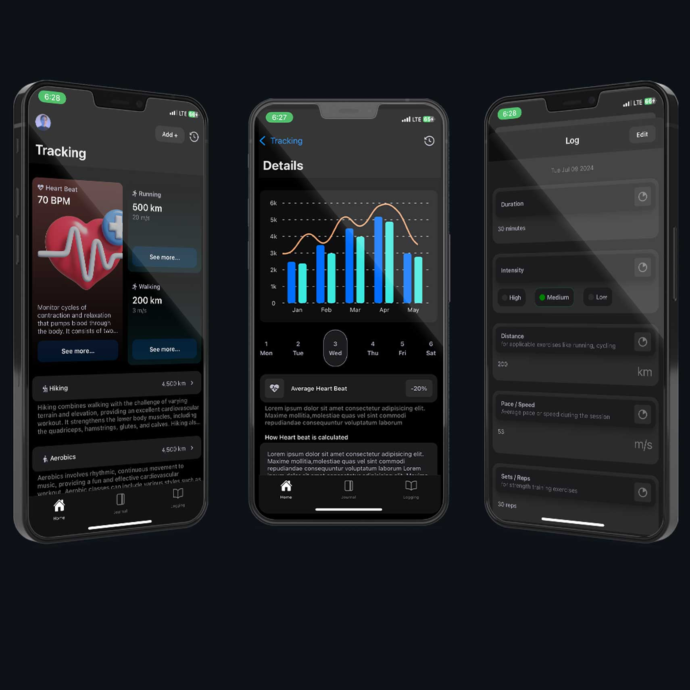

# Health Monitoring Solution for Ghanaians

## Example Images

<p align="center">
  
</p>


## Overview

This project is a comprehensive health monitoring solution designed to enhance the health and well-being of Ghanaians. Built using React Native and Expo, the application includes features such as an activity tracker, journaling tools, and exercise and workout logging. These features aim to help users monitor their health, adopt healthier lifestyles, and make informed decisions about their well-being.

### Figma Designs
https://www.figma.com/design/eY8WT8PGe0aURlhKfjgaiL/Health-tracker?node-id=0-1&t=D04IZ2Ym7aKIBGdc-0

## Features

### Activity Tracker 
by [Prince-Nedjoh]

The activity tracker monitors users' daily physical activities, including steps taken, distance covered, and calories burned. 

- **Data Collection:** Utilizes the phone's built-in sensors (accelerometer and gyroscope) or integrates with wearable devices.
- **Data Processing:** Converts raw sensor data into meaningful metrics.
- **User Interface:** Displays activity metrics, progress charts, and daily/weekly summaries.

**Benefits:**
- Encourages users to be more active.
- Helps users understand their physical activity patterns.
- Promotes a more active lifestyle, reducing the risk of lifestyle-related diseases.

### Journaling Tools

The journaling tools allow users to record their daily health-related activities, moods, diet, sleep patterns, and other personal observations.

- **Data Entry:** Provides easy-to-use forms and prompts.
- **Data Storage:** Uses secure cloud-based storage.
- **Analysis:** Analyzes logged data to provide insights.

**Benefits:**
- Helps users track habits and behaviors.
- Enables users to identify unhealthy patterns.
- Supports mental health through reflection and mindfulness.

### Exercise and Workout Logging

This feature allows users to log their workouts and exercise routines, including types of exercises, duration, intensity, and other details.

- **Exercise Database:** Contains a comprehensive database of exercises with descriptions, images, and instructional videos.
- **Logging Interface:** Offers a user-friendly interface for logging workouts.
- **Progress Tracking:** Provides visual feedback on progress over time.

**Benefits:**
- Encourages regular exercise.
- Helps users set and achieve fitness goals.
- Provides motivation through progress visualization.

## Development

### Technologies Used

- **React Native:** For building the mobile application.
- **Expo:** For simplifying the development and deployment process.

### Installation

1. Clone the repository:
    ```bash
    git clone https://github.com/princenedjoh/health-tracker.git
    cd health-tracker
    ```

2. Install dependencies:
    ```bash
    npm install
    ```

3. Start the application:
    ```bash
    expo start
    ```

## Contribution

We welcome contributions from the community. To contribute:

1. Fork the repository.
2. Create a new branch:
    ```bash
    git checkout -b feature-name
    ```
3. Make your changes and commit them:
    ```bash
    git commit -m 'Add feature'
    ```
4. Push to the branch:
    ```bash
    git push origin feature-name
    ```
5. Open a pull request.


## Contact

For any questions or feedback, please contact me at princenedjoh5@gmail.com.

---